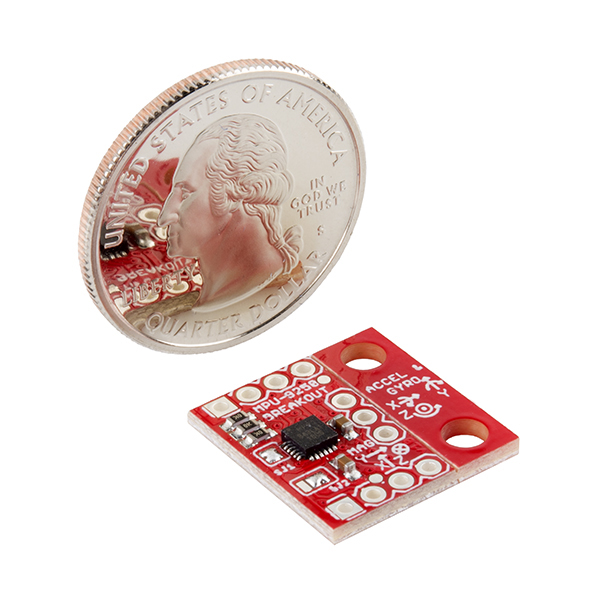

MPU-9250
==========

`Sparkfun <www.sparkfun.com>`_ designed and built this board. They also wrote an `Arduino
library <https://github.com/sparkfun/MPU-9250_Breakout>`_ for it.

I made this python library for use on the Raspberry Pi.

Description
~~~~~~~~~~~~~

MPU-9250 is a multi-chip module (MCM) consisting of two dies integrated into a
single QFN package. One die houses the 3-Axis gyroscope and the 3-Axis
accelerometer. The other die houses the AK8963 3-Axis magnetometer from Asahi
Kasei Microdevices Corporation. Hence, the MPU-9250 is a 9-axis MotionTracking
device that combines a 3-axis gyroscope, 3-axis accelerometer, 3-axis
magnetometer and a Digital Motion Processor™ (DMP) all in a small 3x3x1mm
package available as a pin-compatible upgrade from the MPU-6515. With its
dedicated I2C sensor bus, the MPU-9250 directly provides complete 9-axis
MotionFusion™ output. The MPU-9250 MotionTracking device, with its 9-axis
integration, on-chip MotionFusion™, and run-time calibration firmware, enables
manufacturers to eliminate the costly and complex selection, qualification, and
system level integration of discrete devices, guaranteeing optimal motion
performance for consumers. MPU-9250 is also designed to interface with multiple
non-inertial digital sensors, such as pressure sensors, on its auxiliary I2C
port.

MPU-9250 features three 16-bit analog-to-digital converters (ADCs) for digitizing the gyroscope outputs,
three 16-bit ADCs for digitizing the accelerometer outputs, and three 16-bit ADCs for digitizing the
magnetometer outputs. For precision tracking of both fast and slow motions, the parts feature a user programmable
gyroscope full-scale range of ±250, ±500, ±1000, and ±2000°/sec (dps), a user programmable
accelerometer full-scale range of ±2g, ±4g, ±8g, and ±16g, and a magnetometer full-scale
range of ±4800µT.

Communication with all registers of the device is performed using either I2C at
400kHz or SPI at 1MHz. For applications requiring faster communications, the
sensor and interrupt registers may be read using SPI at 20MHz. [Section 1.3, Datasheet]

Install
---------

The preferred way to install this library is with ``pip``::

	pip install mpu9250

Hookup
--------

======= ============= =============
Device  Sensor        I2C Address
======= ============= =============
MPU9250 Accels/Gyros  0x68
AK8963  Magnetometer  0x0C
======= ============= =============

::

	pi@create mpu9250 $ sudo i2cdetect -y 1
	     0  1  2  3  4  5  6  7  8  9  a  b  c  d  e  f
	00:          -- -- -- -- -- -- -- -- -- 0c -- -- --
	10: -- -- -- -- -- -- -- -- -- -- -- -- -- -- -- --
	20: -- -- -- -- -- -- -- -- -- -- -- -- -- -- -- --
	30: -- -- -- -- -- -- -- -- -- -- -- -- -- -- -- --
	40: -- -- -- -- -- -- -- -- -- -- -- -- -- -- -- --
	50: -- -- -- -- -- -- -- -- -- -- -- -- -- -- -- --
	60: -- -- -- -- -- -- -- -- 68 -- -- -- -- -- -- --
	70: -- -- -- -- -- -- -- --

.. raw:: html

	

	
	
	

`Sparkfun <https://learn.sparkfun.com/tutorials/mpu-9250-hookup-guide>`_ has a
great guide to get you started, just replace the Arduino C++ with this python
library.

License
----------

**The MIT License (MIT)**

Copyright (c) 2017 Kevin J. Walchko

Permission is hereby granted, free of charge, to any person obtaining a copy of
this software and associated documentation files (the "Software"), to deal in
the Software without restriction, including without limitation the rights to
use, copy, modify, merge, publish, distribute, sublicense, and/or sell copies
of the Software, and to permit persons to whom the Software is furnished to do
so, subject to the following conditions:

The above copyright notice and this permission notice shall be included in all
copies or substantial portions of the Software.

THE SOFTWARE IS PROVIDED "AS IS", WITHOUT WARRANTY OF ANY KIND, EXPRESS OR
IMPLIED, INCLUDING BUT NOT LIMITED TO THE WARRANTIES OF MERCHANTABILITY, FITNESS
FOR A PARTICULAR PURPOSE AND NONINFRINGEMENT. IN NO EVENT SHALL THE AUTHORS OR
COPYRIGHT HOLDERS BE LIABLE FOR ANY CLAIM, DAMAGES OR OTHER LIABILITY, WHETHER
IN AN ACTION OF CONTRACT, TORT OR OTHERWISE, ARISING FROM, OUT OF OR IN
CONNECTION WITH THE SOFTWARE OR THE USE OR OTHER DEALINGS IN THE SOFTWARE.
